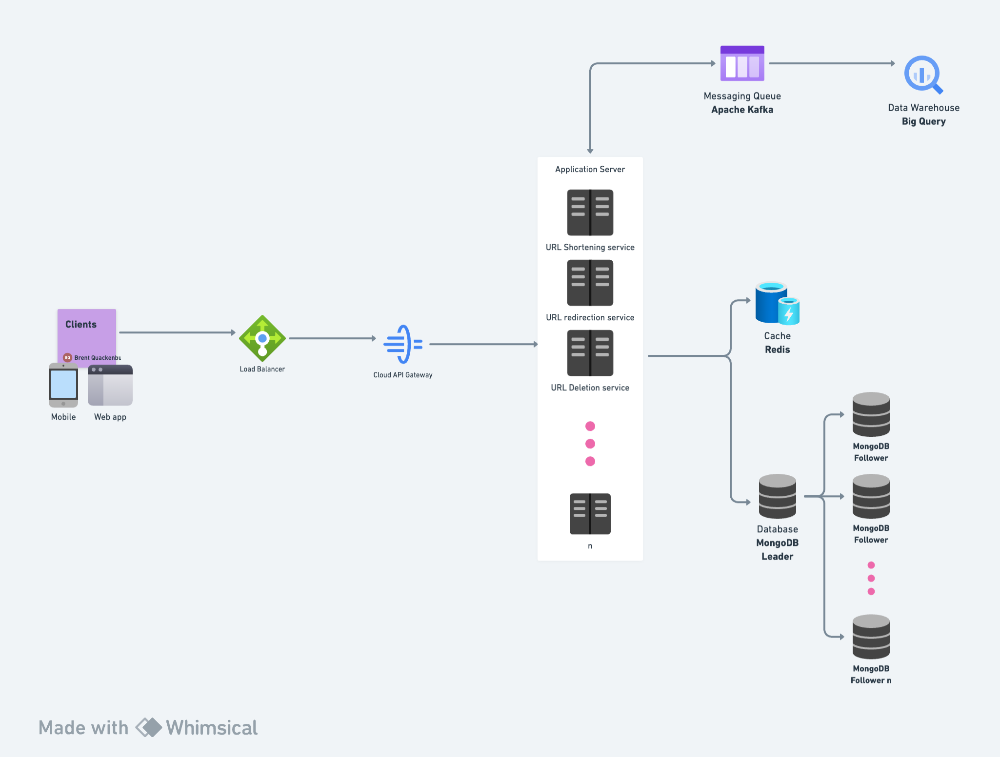

# URL Shortener Service

> **TL;DR** A URL shortener service creates a short url sometimes known as a tiny url. When a user clicks on the tiny url, they get redirected to the original url. 

There can be a number of different features and services in a seemingly *small* service like URL shortening. 

It is always a good idea to ask the interviewer what features are expected. This then becomes the basis of functional requirements.

### What should be the character limit for each shortened URL, and are they designed to be permanent or have a specific validity period?

The length of shortened URLs typically ranges between 6 to 10 characters, excluding the domain part. This length strikes a balance between having a sufficiently large namespace to avoid collisions and maintaining the URL's brevity. Regarding permanence, it is common practice to make shortened URLs permanent. This decision aligns with user expectations for reliability and the long-term accessibility of links. However, implementing a background service to periodically check and remove URLs that lead to inactive or non-existent pages can maintain database hygiene.

### Does the service offer users the flexibility to customize their shortened URLs, and if so, what is the maximum length allowed for these custom URLs?:

Allowing users to customize their shortened URLs is a feature that enhances user engagement and memorability of the links. A common practice is to set a maximum length of about 16 characters for custom URLs. This limit is a balance between giving users enough flexibility for customization and maintaining the short, concise nature of the URLs. It's crucial to implement security measures to prevent the creation of misleading or harmful custom URLs, which can include filtering out offensive words and avoiding look-alike URLs to well-known domains.

### What is the estimated volume of URL shortening requests the service is expected to handle monthly?

Handling 100 million new URL shortenings per month requires a system designed for high scalability and availability. Leveraging cloud services with auto-scaling capabilities and implementing a distributed database system are key to managing this volume. Employing caching mechanisms and load balancers can significantly reduce response times and server load. It's also essential to plan for higher-than-expected traffic spikes to ensure system resilience.

### Is it a requirement for the service to track and report key metrics such as the frequency of visits for each link?

Providing analytics such as the most visited links, geographic data of visitors, click-through rates, and other engagement metrics is crucial for a modern URL shortening service. These analytics are not just an add-on but a core feature, especially for businesses using these services for marketing and customer engagement. Implementing real-time analytics with tools like Apache Kafka for streaming data processing and using Big Data platforms can offer valuable insights. Additionally, ensuring GDPR compliance and user privacy is paramount when handling user data for analytics.

## Functional Requirements:

1. Service should be able to create shortened url/links against a long url
2. Click to the short URL should redirect the user to the original long URL
3. Users can create custom url with maximum character limit of 16
4. Service should collect metrics like most clicked links
5. Once a shortened link is generated it should stay in system for lifetime

## Non-Functional Requirements:

1. Service should be up and running all the time
2. URL redirection should be fast and should not degrade at any point of time (Even during peak loads)
3. Service should expose REST API’s so that it can be integrated with third party applications

## (1/2) Resource Estimation

### Traffic Estimation and Read/Write Ratio

- **Read/Write Ratio Assumption**: For the sake of this analysis, we'll consider a common read-to-write ratio observed in URL shortening services, which is about 200:1. This reflects the higher frequency of read (redirection) operations compared to write (URL shortening) operations.

###  URL Generation Rate Calculation:

- **Monthly URL Shortenings**: Estimated at 100 million.
- **Secondly URL Generation Rate**: To find the rate per second, we divide the monthly figure by the number of seconds in a month:
- **Calculation**: 100 million URLs / (30 days * 24 hours/day * 3600 seconds/hour).
- **Result**: Approximately ~40 URLs/second.
Redirection Rate Calculation:

Given the 200:1 read/write ratio, the redirections per second can be estimated as:
40 URLs/second * 200 (read/write ratio) = 8000 URLs/second.

## (2/2) Storage Requirements

### Long-Term Storage Calculation

- **Service Lifetime**: Assuming the service is intended to last 100 years.
- **Total Data Points**: Over this period, the total number of unique shortened links expected: 100 million/month * 12 months/year * 100 years = 120 billion.
- **Average Data Object Size**: Let's assume each record (including the short URL, original URL, creation date, etc.) averages 500 bytes.

> Total storage requirement: 120 billion * 500 bytes ≈ 60 terabytes (TB).

### Memory and Caching Strategy

* **Daily Redirection Requests**: Based on the estimated redirection rate of 8000 URLs/second:

* **Daily requests**: 8000 requests/second * 86400 seconds/day ≈ 700 million requests/day.

* **Caching Strategy**: Applying the [_80:20 Pareto Principle_](https://en.wikipedia.org/wiki/Pareto_principle), where 80% of the requests might be for 20% of the URLs.
  
> To cache these popular URLs, the memory requirement can be approximated as: 20% of 700 million * 500 bytes ≈ 70 gigabytes (GB).

### Summary Estimates

> - **URL Generation Rate**: ~40 URLs/second.
> - **Projected URLs over 100 Years**: 120 billion.
> - **Total URL Redirection Requests**: ~8000/second.
> - **Storage Requirement for 100 Years**: 60 TB.
> - **Cache Memory Requirement**: ~70 GB.

## High Level Design

```
   +------------+         +-------------------+
   |            |         |   API Gateway     |
   |   Client   +-------->+                   |
   |  (Browser, +<--------+ (Route Requests)  |
   |   Mobile)  |         +---------+---------+
   +------------+                   |
                                     |
                                     |
                                     v
                   +-----------------+------------------+
                   |                                     |
                   |       Load Balancer                 |
                   |                                     |
                   +-----------------+------------------+
                                     |
                                     |
    +--------------------------------+--------------------------------+
    |                                |                                |
    |                                |                                |
    v                                v                                v
+---+------+                  +------+-------+                 +-------+------+
|          |                  |              |                 |              |
| App      |                  | App          |                 | App          |
| Server 1 |                  | Server 2     |                 | Server N     |
|          |                  |              |                 |              |
+---+------+                  +------+-------+                 +-------+------+
    |                                |                                |
    |                                |                                |
    |                                |                                |
    +--------------------------------+--------------------------------+
                                     |
                                     |
                                     v
                              +------+------+
                              |             |
                              |  Database   |
                              |             |
                              +------+------+
                                     |
                                     |
                                     v
                              +------+------+
                              |             |
                              |   Cache     |
                              |             |
                              |             |
                              +-------------+

```

> ### User Interaction Flow:
> 1. **User Clicks a Link**: When a user clicks on a shortened URL or makes a request to shorten a URL through the User Interface (UI), the request is first sent to the API Gateway.
> 2. **API Gateway**: The API Gateway is the entry point for all client requests to the backend system. It's like a gatekeeper or a front desk, handling initial processing of the request. Its roles include:
>    - **Routing**: Directing the request to the appropriate service within the application servers. For example, it decides whether the request should go to the URL shortening service or the URL redirection service.
>    - **Authentication and Authorization**: Verifying if the request comes from a valid user and whether they have the right to perform the requested operation.
>    - **Rate Limiting**: Preventing abuse of the service by limiting the number of requests a user can make within a certain time frame.
>    - **Logging and Monitoring**: Keeping track of incoming requests for analytics and monitoring purposes.
>    - **Request Transformation**: Modifying the request format as needed before sending it to application servers.
> 3. **Load Balancer**: After initial processing by the API Gateway, the request is forwarded to a Load Balancer. The Load Balancer's job is to distribute incoming application traffic across multiple servers, ensuring no single server bears too much load. This improves the scalability and availability of the application.
> 4. **Application Servers**: The Load Balancer routes the request to one of the available application servers. These servers handle the core business logic, such as generating a short URL or redirecting to the original URL.
> 5. **Database and Cache**: The application server may interact with a database to retrieve or store information and with a cache to access frequently requested data quickly.

## REST Endpoints
### 1. Create Short URL Endpoint

- **Endpoint**: `POST /v1/create`
- **Purpose**: To create a new short URL.
- **Request Body**:
  ```json
  {
    "long_url": "http://example.com/longurlpath",
    "custom_url": "CustomShortLink" 
  }
  ```
- **Parameters**:
  - **long_url** (required): The original, long URL that needs to be shortened.
  - **custom_url** (optional): A custom alias for the short URL. If not provided, the system will generate a random one.
- **Response**:
  - Success (200 OK): Returns the generated short URL.
  ```json
      {
      "short_url": "http://tinyurl.com/xyz123"
      } 
  ```
  - Error: Returns an appropriate error message and status code for failures (e.g., invalid URL format).

### 2. URL Redirection Endpoint

- **Endpoint**: `GET v1/{short_url}`
- **Purpose**: To redirect a short URL to its corresponding long URL.
- **Parameters**:
   - **short_url**: The short URL segment after the base URL (e.g., xyz123 in `http://tinyurl.com/xyz123`).
- **Response**:
   - **Redirect (HTTP 302 Found)**: Redirects the user to the original long URL.
   - **Error**: Returns an error message and status code for invalid or non-existing short URLs.

## URL Shortening Algorithms

### A. URL Encoding

  - [Base62 Encoding](https://en.wikipedia.org/wiki/Base62): Utilizes a character set of 62 (a-z, A-Z, 0-9) for URL encoding. Efficient for producing relatively short URLs.
  - [MD5 Encoding](https://www.md5hashgenerator.com/): Uses MD5 hashing to generate a hash of the original URL, then uses a portion of the hash for the short URL. This method may introduce collision risks and requires collision handling.

### B. Key Generation Service (KGS)

  - A pre-emptive key generation approach where short URLs are generated and stored beforehand. When a new short URL is requested, a pre-generated key is assigned, ensuring uniqueness and reducing runtime collision risks.

## Database Schema
### User Data Schema (Optional for Future Implementation)

- **User ID**: Unique identifier for each user.
- **Name**: User's name.
- **Email**: User's email address.
- **Creation Date**: Date of user registration.

### ShortLink Data Schema

- **Short URL**: Unique short URL (6-7 characters long).
- **Original URL**: The original, long URL.
- **User ID**: Identifier of the user who created the short URL (optional, for future use).

## Low-level Design

### Leveraging Cache

For the caching layer, we'll want a system that:

> - **Is Fast**: It must serve requests with minimal latency to ensure quick redirections.
> - **Supports High Throughput**: The cache should handle a large number of reads and writes per second.
> - **Offers High Availability**: It should have mechanisms in place to ensure it is resilient to failures.
> - **Provides Eviction Policies**: It should have configurable eviction policies to maintain a fresh and relevant set of data (like LRU - Least Recently Used).

Given these criteria, **Redis** is a frequent choice for the following reasons:

- **Performance**: Redis is an in-memory data store, which means it can serve read and write operations with sub-millisecond latency. Support for Complex Data Types: It supports strings, hashes, lists, sets, and sorted sets, which can be leveraged for various caching strategies.
- **Scalability**: Redis can be scaled out through clustering to handle increased load.
- **Durability**: With Redis, you have the option to persist data on disk, which can prevent data loss in case of a system crash.
- **Rich Feature Set**: Includes built-in replication, Lua scripting, LRU eviction, transactions, and different levels of on-disk persistence.

[A great read on the differences between memcached and redis.](https://engineering.kablamo.com.au/posts/2021/memcached-vs-redis-whats-the-difference/)

### What Type of Database?
For the database, considering that you need to store URLs with high availability and consistent performance, a NoSQL database like **MongoDB** is suitable due to:

#### Choosing MongoDB for URL Shortener Service

- **Rationale for MongoDB**:
MongoDB is chosen for its flexibility, scalability, and performance characteristics which are well-suited for a URL shortener service that requires high read/write throughput and efficient storage of simple key-value pairs.

- **Schema-less Nature**: Allows for flexibility in data modeling, which is beneficial for the evolving requirements of a URL shortener service.
- **Performance**:
Offers high-performance data retrieval using indexing, which is critical for the quick resolution of short URLs.

- **Scalability**: Native sharding and replication support make it a good fit for distributed systems that need to handle large amounts of traffic and data.
- **Developer Friendly**: Rich ecosystem and drivers for various programming languages, including Kotlin, facilitate ease of development and integration.

### MongoDB Data Model:
#### Collections/Data Structures:

- `Users`: Stores user information for potential future features like dashboard access, link management, etc.
- `ShortLinks`: Stores the mappings between short and original URLs.

#### ShortLinks Collection Schema:

```kotlin
data class ShortLink(
    val id: ObjectId, // MongoDB unique identifier, usually named _id
    val shortUrl: String,
    val originalUrl: String,
    val creationDate: Date,
    val userId: String? = null // nullable for optional user ID
)
```

Users Collection Schema:

```kotlin
data class User(
  val id: ObjectId, // MongoDB unique identifier, usually named _id
  val username: String,
  val email: String,
  val creationDate: Date
)
```

### Apache Kafka in a Distributed System

> **Apache Kafka** is a distributed event streaming platform that is designed to handle high volumes of data and enables the building of real-time streaming data pipelines and applications.

### **Role of Kafka**:
- **Event Publishing**: Services within the distributed system (like the URL redirection service) publish events to Kafka. These events can be anything of significance - for instance, every time a short URL is clicked, an event is created with details about the click.

- **Event Storage**: Kafka stores these events in a fault-tolerant manner across its distributed architecture. It ensures that data is replicated so that no information is lost if a broker (Kafka server) fails.

- **Event Consumption**: The consumers, which could be an analytics processing service, subscribe to relevant Kafka topics (channels) and consume the events for processing. Kafka provides ordering guarantees within a topic partition and ensures that consumers can read events at their own pace.

Kafka Topics:
- Kafka organizes messages into topics. In the case of a URL shortener, you might have a topic named url-clicks where all click events are sent.

Kafka Producers and Consumers:
- **Producers**: The URL redirection service acts as a Kafka producer when it sends a message (event) to the Kafka topic.
- **Consumers**: The analytics processing service acts as a Kafka consumer. It might use Kafka's Streams API for real-time processing or connect to a batch processing system like Apache Spark for heavier analytics tasks.

### Data Warehouse in a Distributed System

> A data warehouse is a centralized repository for storing large amounts of structured, filtered data that has been processed for a specific purpose.

Integration with Kafka:
- The analytics processor consumes and processes data from Kafka and then loads it into the data warehouse.

Role of Data Warehouse:
1. **Data Storage**: It stores large volumes of data in a structured format, optimized for query performance and analysis.
2. **Data Analysis**: It allows for complex queries, aggregations, and analysis across large datasets.
3. **Business Intelligence**: It serves as the source of data for business intelligence tools and dashboards.

### Data Warehouse Configurations:

- **Star Schema**: Often data warehouses are structured in a star schema for analytics, with fact tables (like clicks) and dimension tables (like users, urls).
- **Data Lifecycle**: Policies for data lifecycle management, including archiving old data and purging data that is no longer needed, while ensuring compliance with data retention policies.

### Low-Level Detail of Data Flow:

1. **Capture**: A user clicks on a shortened URL, which is captured by the URL redirection service.

2. **Publish Event**: The redirection service publishes an event to Kafka. This event might include data such as the short URL ID, the timestamp of the click, user agent details, and the referrer.

3. **Kafka Topic**: The event is stored in a Kafka topic, say url-click-events, which is configured to handle a high-throughput stream of data.

4. **Event Processing**:
- **Real-Time**: For real-time analytics, a streaming processor like Kafka Streams or Apache Flink reads from the url-click-events topic as new data arrives and processes it on the fly. This could involve computing real-time click rates, geographic distributions, etc.
- **Batch**: For less time-sensitive analytics, a batch processing system like Apache Spark might run at set intervals, consuming events from Kafka, and executing complex computations or ETL (Extract, Transform, Load) jobs.

5. **Load into Data Warehouse**: The processed data is then loaded into tables within the data warehouse. This could be a batch load or a continuous stream, depending on the capabilities of the data warehouse and the real-time requirements of the analytics.

6. **Data Warehouse Structure**:
- **Tables/Schema**: The data warehouse will have tables corresponding to the analytics requirements. For instance, a clicks table with columns for short_url_id, click_timestamp, user_agent, referrer, etc.
- **Indexes and Partitions**: To optimize for query performance, the data warehouse will have appropriate indexes, and the data might be partitioned by date or another relevant key.

7. **Analysis and Reporting**:
- **BI Tools**: Business intelligence tools such as Tableau, Looker, or Power BI connect to the data warehouse to create reports and dashboards.
- **Custom Analytics Applications**: If you have custom analytics needs, you might also have applications or services that query the data warehouse directly to serve specific analytical data to users or other systems.

